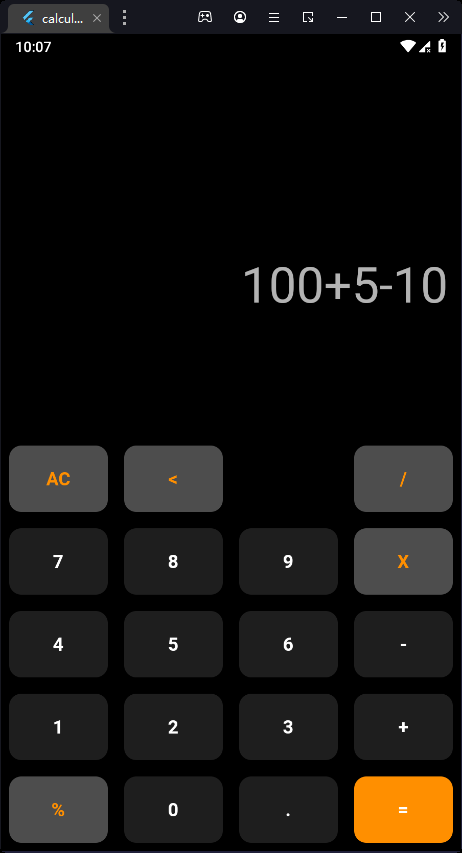
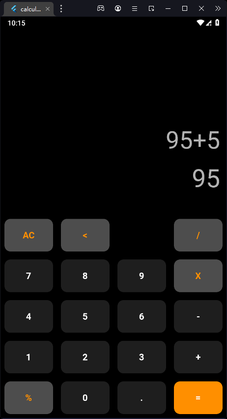
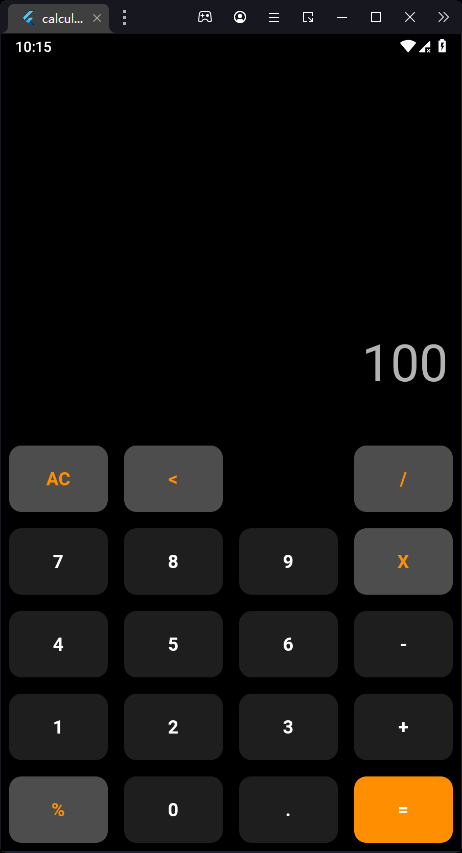

# Flutter Calculator

This is a simple calculator app built using Flutter.

# Features

    Addition, subtraction, multiplication, and division operations
    Clear and delete buttons
    Responsive layout for various screen sizes

# Installation

    Clone the repository: git clone https://github.com/mhmadamrii/Flutter-CalculatorApp.git
    Navigate to the project directory: cd flutter-calculator
    Install the dependencies: flutter pub get
    Run the app: flutter run

# Usage

Simply enter numbers and select the desired operation to perform the calculation. Use the clear button to reset the input and result, and the delete button to remove the last entered character.
Contributing

Contributions are always welcome! If you'd like to contribute to this project, please open an issue or a pull request.
License

This project is licensed under the MIT License.
Credits

# This app was built using the following open-source packages:

    flutter
    math_expressions

Screenshots